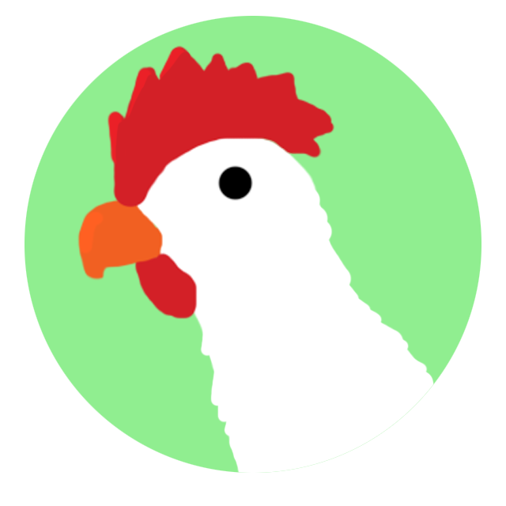
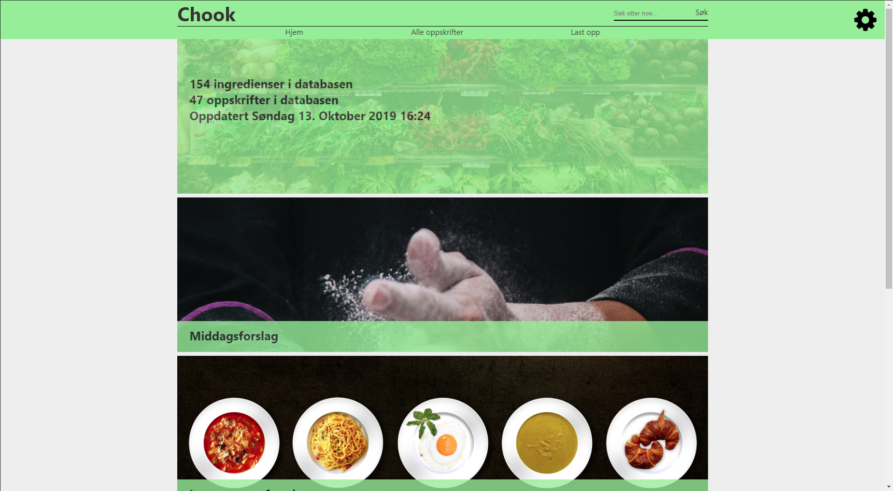
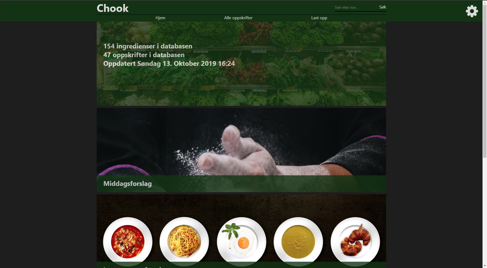

# Chook

A React website for recipes and general dinner planning. "Chook" (tʃʊk) is a combination of "chef" and "cook", and also happens to be a slang term for chicken.
Considering the double O's, the name has a chance of becoming a famous internet company, according to Gwyneth Paltrow; "successful internet companies have double O's in their name".

## Usage (Windows)
1. $ `npm install`
2. $ `npm start`

## Usage (Heroku)
1. Create a new project
2. Connect to Github repository
3. Set up environment variables in Heroku
4. Build and deploy

## TODO
- [x] Functioning webpage
- [x] Frontpage
- [x] Header
- [x] Redux
- [x] Contrastmode
- [x] Minimal styling
- [x] Dev page
- [x] Linking to pages
- [x] Database connection
- [x] List of recipes
- [x] Page for recipe details
- [x] Search
- [x] Alert toast
- [ ] Uploading to DB
- [ ] Editing DB data
- [ ] Dinner planning features
- [ ] Settings
- [ ] Footer
- [ ] Users
- [ ] Moderation tools
- [ ] Deploying to designated server
- [ ] Better sorting (ex alphabetical order)
- [ ] General optimization
- [ ] Timer
- [ ] Roadmap update

- [ ] Internet crawler or fentch from API for ingredients
- [ ] Internet crawler or fentch from API for recipes

## Ongoing TODOs
- [ ] Find, try, and upload recipes
- [ ] Testing
- [ ] Use EM
- [ ] Style

## Known issues

- Things are not looking good. Not figuratively but literally, style is not my strong suit.
- White line (padding due to some elements, varies per page) visible on the bottom of the screen.

## My Thoughts

Having an interest for cooking and programming, a project like this was inevitable. The problem, however, was figuring out what to make, how to make it, when to make it, and where to do it. The conclusion was first an app, then a webpage, then an API, then a helper webpage to upload data, then back to webpage. 

I think I've come to a final conclusion that a webpage is the superior option, and that I will first make a simple one with React, then add API functions as necessary.

Special thanks to [Pexels](https://www.pexels.com) for the pictures.

-------------------------------------------------------------------------------------------------------------------------------

This project was bootstrapped with [Create React App](https://github.com/facebook/create-react-app).

## Available Scripts

In the project directory, you can run:

### `npm start`

Runs the app in the development mode. 
Open [http://localhost:3000](http://localhost:3000) to view it in the browser.

The page will reload if you make edits. 
You will also see any lint errors in the console.

### `npm test`

Launches the test runner in the interactive watch mode. 
See the section about [running tests](https://facebook.github.io/create-react-app/docs/running-tests) for more information.

### `npm run build`

Builds the app for production to the `build` folder. 
It correctly bundles React in production mode and optimizes the build for the best performance.

The build is minified and the filenames include the hashes. 
Your app is ready to be deployed!

See the section about [deployment](https://facebook.github.io/create-react-app/docs/deployment) for more information.

## Learn More

You can learn more in the [Create React App documentation](https://facebook.github.io/create-react-app/docs/getting-started).

To learn React, check out the [React documentation](https://reactjs.org/).